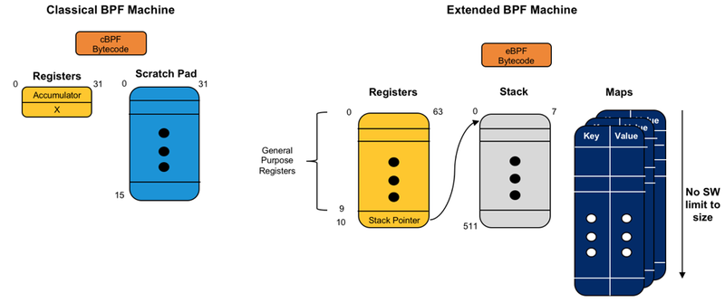

# BPF, eBPF, XDP and Bpfilter

----
`https://www.netronome.com/blog/bpf-ebpf-xdp-and-bpfilter-what-are-these-things-and-what-do-they-mean-enterprise/`
----

1. 1992年Van Jacobson实现了BPF(Berkeley Packet Filer)。在Linux-3.15中，引入了eBPF(extended Berkeley Packet Filter)。

2. 本质上，eBPF与BPF是一样的

3. BPF与eBPF的区别如下图所示：
  

BPF的寄存器：

eBPF的寄存器：

3.
